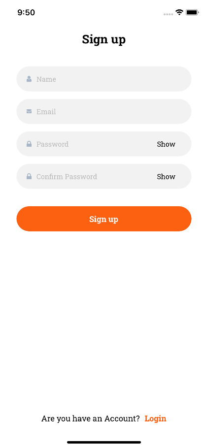

# Travel Application

Where & Go - Example with MVVM Architecture pattern using RxSwift.
Clean Architecture partial application.

## Features
- Explore tourist attractions
- Search for favorite places
- Share places to the community: like, share and comment

## Deployment Setup

Clone the repository and run following commands 

```bash
  pod install
```


## Screenshots
&nbsp;

&nbsp;&nbsp;

&nbsp;&nbsp;&nbsp;

&nbsp;&nbsp;

&nbsp;&nbsp;&nbsp;

## API Reference

The app makes use of the following APIs:
- Firebase: Authentication, realtime, storage
- Mockapi.io

